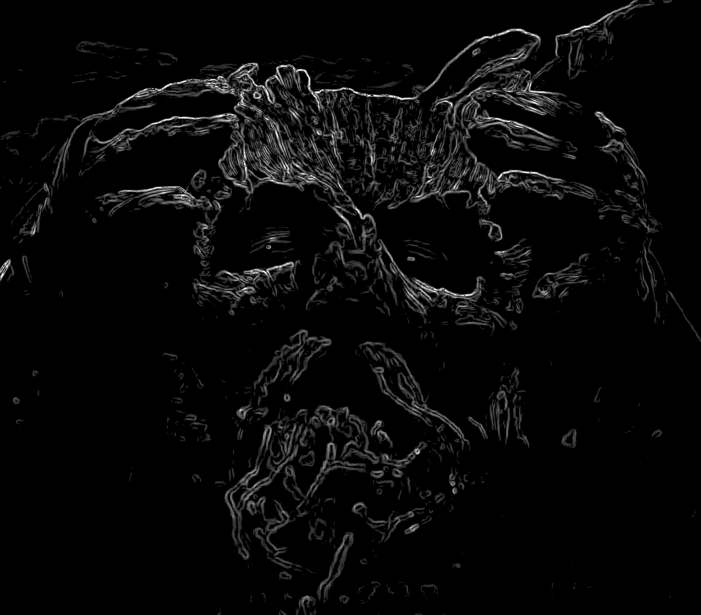

# Sobel-Edge-Detection

This project shows how to implement Sobel edge detection with Python using the Pillow library. The script locates edges of images through change in brightness gradients. It utilizes the Sobel filter to find gradients in the horizontal x and vertical y direction, then combines them and generates an image representing the intensity of edges that were found.

### 1. How It Works

1. **Image Preprocessingr**:
   The input image is Converted to grayscale. To avoid boundary issues when applying filters, the border is padded by 1 pixel (using edge replication).

2. **Sobel Filter**:  
   The Sobel filter is a mathematical operator used to calculate gradients in an image. It uses two 3×3 matrices, defined as:

   **Sobel filter for the x-direction ($G_x$)**:
   
   
  
   $$G_x = \left[ \matrix{ 1 & 0 & -1 \cr 2 & 0 & -2 \cr 1 & 0 & -1 } \right]$$  
   
 

   **Sobel filter for the y-direction ($G_y$)**:

   
  
   $$G_y = \left[ \matrix{ 1 & 2 & 1 \cr 0 & 0 & 0 \cr -1 & -2 & -1 } \right]$$ 
   
 

   These matrices detect changes in brightness:  
   - $G_x$: Detects vertical edges.  
   - $G_y$: Detects horizontal edges.

3. **Gradient Calculation**:   
   For each pixel in the image, a 3x3 region around the pixel is multiplied elementwise by ($G_x$)​ and ($G_y$).
   The horizontal ($g_x$) and vertical ($g_y$) gradients are computed with:
   
   
  
   $$g_x = \sum_{k=1}^n(A \cdot G_x)$$,   $$g_y = \sum_{k=1}^n(A \cdot G_y)$$    
   
  
    
      
   A is define as the source image. The resulting gradient approximations can be combined to give the gradient magnitude, using   

   
  
   $$g = \sqrt{g_x^2 + g_y^2}$$   
   
   

4. **Thresholding**:   
   The gradient magnitude is thresholded to keep only strong edges, with minimum threshold and a maximum.

   

   $$n = \{ 0 \text{ if } g < \text{min threshold}, \, 255 \text{ if } g > \text{max threshold} \} $$
   
 
   
### 2. example
##### input image (Tiger.png, Test2.png):

  
  

##### Output: After applying the Sobel edge detection algorithm (Tiger minimum threshold 30, Test2 minimum threshold 30):

  
  

### 3. How to Use
1. Clone the repository
2. Install dependencies: Ensure that Pillow and numpy is installed with:    `pip install pillow numpy`
3. Place your input image: Put the image you want to use into the same directory as your script, or note its full path if it is elsewhere.
4. Run the script: Navigate to the directory where `sobel_edge_detection.py` is located and run the script:   `python sobel_edge_detection.py`
5. Enter the name of your image: When prompted, enter the filename of your image (or the full path if it’s not in the same folder).
6. View the output: The script will display the processed edge-detected image

### 4. Improvement
Implement non-maximum suppression to thin edges for cleaner results.   
The execution time is still too long, optimization is needed to improve performance.   

### 5. Reference
Tiger.jpg Image from [https://media.istockphoto.com/id/468583653/de/foto/katze-portr%C3%A4t.jpg?s=612x612&w=0&k=20&c=ZeYyvRJXqEvlcbQ1PtAyH5I-Lam2kV-ElTueV3_q0Pk=](https://transforms.stlzoo.org/production/animals/amur-tiger-01-01.jpg?w=1200&h=1200&auto=compress%2Cformat&fit=crop&dm=1658935145&s=95d03aceddd44dc8271beed46eae30bc)   
Test2.png Image from https://www.youtube.com/watch?v=rCPrXlREAdo   
Lethal.jpg Image from https://x.com/PhilipIONO/status/1727828537627783275   
Information for Sobel operator https://en.wikipedia.org/wiki/Sobel_operator
